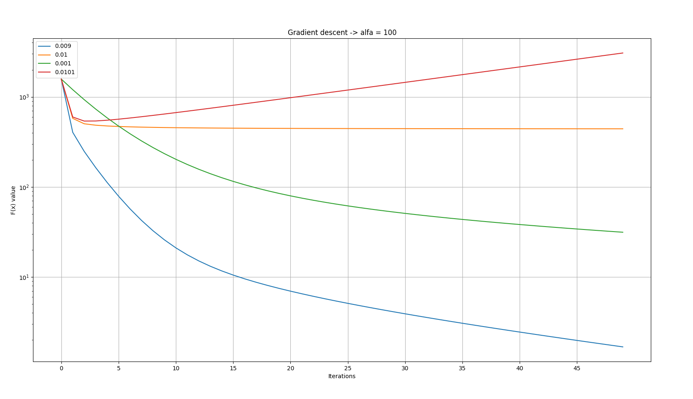

# Gradient descent

## Table of contents
* [General info](#general-info)
* [Technologies](#technologies)
* [Results](#results)

## General info
This project is implementation of gradient descent algorithm in Python.

File `gradient_descent.py` contains program body.

File `gradient_sprawozdanie.pdf` contains repot of my experiments on this implementation writen in Polish.
## Technologies
Project is created with:
* autograd
* numpy
* dataclasses

and tested with:
* matplotlib
* time

## Results

### First function:

### Second function:

### Third function:

